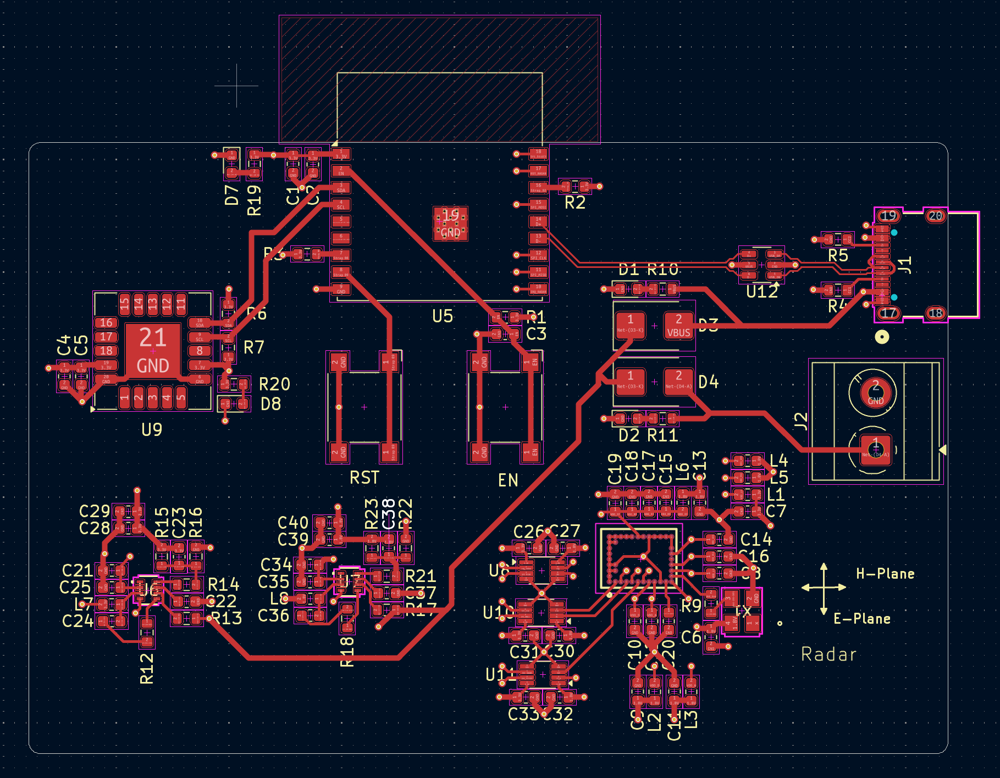
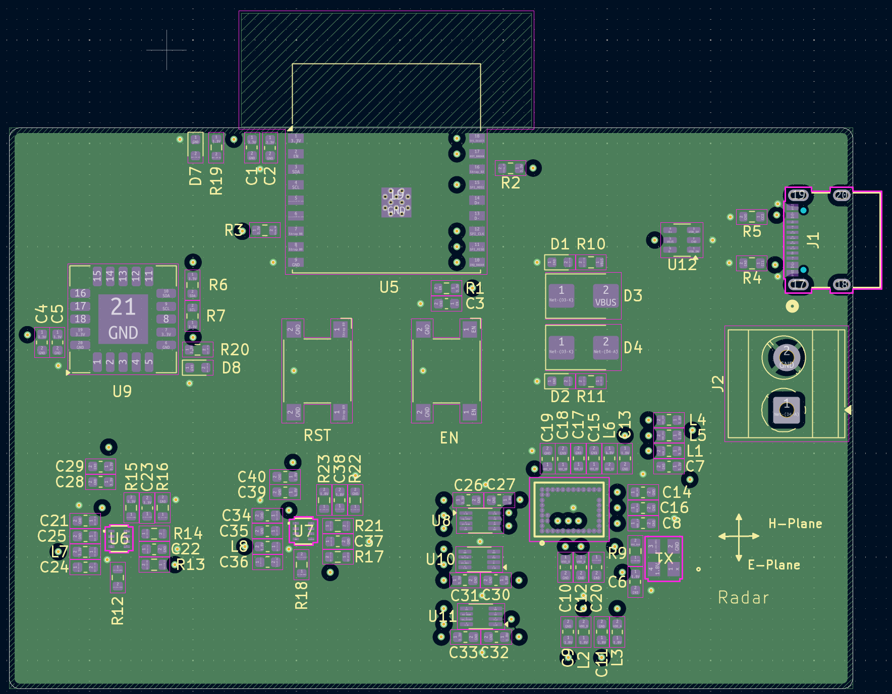
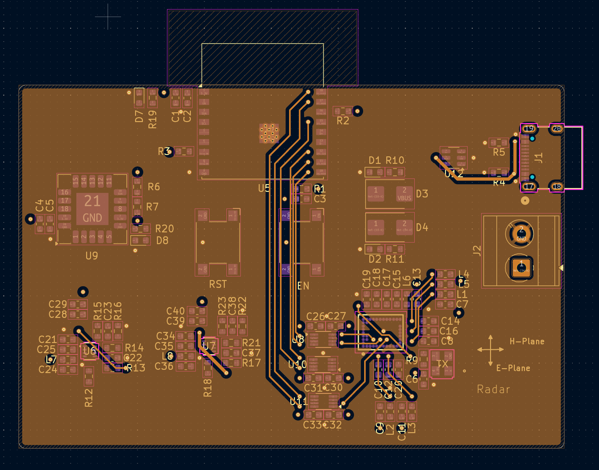
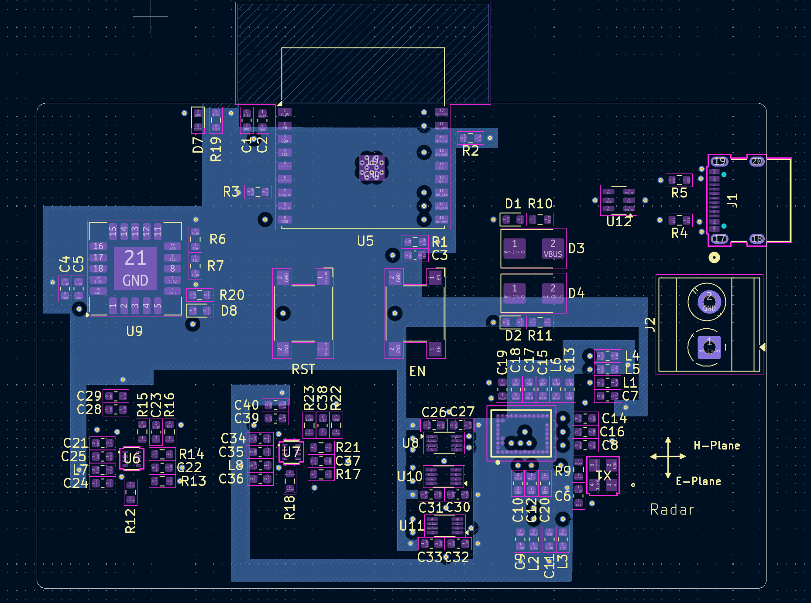

# 🦝 Racool — Innoserv Awards Contest

<div align="center">
  
  
</div>

## About

This repository hosts the hardware design presented at the *Innoserv Awards Contest*, held in October 2025 in Taiwan.

**Racool** is a compact PCB that estimates how many people are present in a closed space without cameras and without identifying anyone. It combines a 60 GHz radar for presence/occupancy sensing with a CO₂ / temperature / humidity sensor, all driven by an ESP32 microcontroller with Wi‑Fi and Bluetooth LE connectivity.

## Use cases

Racool is designed for any enclosed space where occupancy and air quality matter:

- Public transport (buses, trains, metros)
- Hospital and clinic waiting rooms
- Restaurants and cafés
- Gyms and fitness clubs
- Offices, meeting rooms, classrooms

## Key features

- **Anonymous by design**: radar sensing captures no images, no sound and no personal data.
- **Air-quality awareness**: real CO₂, temperature and humidity measurements.
- **Wireless**: Wi‑Fi and BLE for data reporting.
- **Compact & simple**: single board, powered and programmed over USB‑C.

## Hardware

- **ESP32‑C3‑WROOM‑02** : Main MCU with Wi‑Fi and BLE; runs the firmware and processes sensor data 
- **BGT60TR13C** (Infineon) : 60 GHz FMCW radar sensor used for presence / occupancy detection 
- **SCD41** (Sensirion) : Photoacoustic CO₂ sensor with integrated temperature and humidity sensing 
- **MP2232HGTL** : Power management 
- **USB‑C connector** : Programming and power supply 

## How it works

```
 ┌────────────┐  SPI   ┌──────────────┐        ┌────────────────┐
 │ BGT60TR13C │───────▶│              │  Wi‑Fi │  Cloud /       │
 │ (60 GHz)   │        │  ESP32‑C3    │───────▶│  dashboard     │
 └────────────┘        │              │  BLE   │  (optional)    │
 ┌────────────┐  I²C   │              │        └────────────────┘
 │   SCD41    │───────▶│              │
 │ CO₂/T/RH   │        └──────────────┘
 └────────────┘              ▲
                        USB‑C / power
```

1. The radar captures motion and micro-motion signatures in the room.
2. The MCU processes them to estimate occupancy.
3. The SCD41 provides CO₂, temperature and humidity readings.
4. Data is sent over Wi‑Fi/BLE to a dashboard or gateway.


## Layers and 3D view

<div align="center">
<br>
Top layer<br>

<br>
  Ground layer<br>
<br>
  Inside layer<br>
<br>
  Bottom layer<br>
</div>
